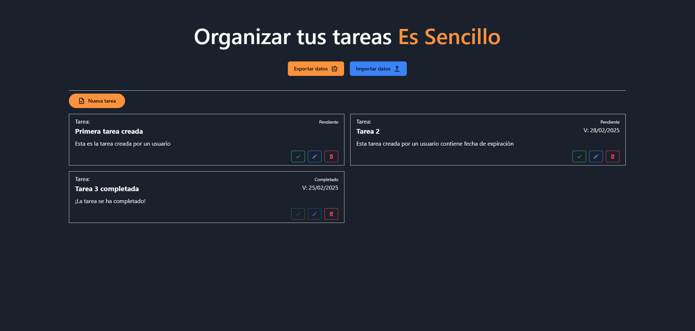

# React + TypeScript + Vite

Esta aplicación permite crear tareas por cada usuario que se encuentre registrado. La aplicación se conecta a la API del repositorio [TodoList](https://github.com/conettoovando/TODOList) el cual contiene los metodos de conexion a la base de datos que registra al usuario y le permite las funcionalidades CRUD.

Para evitar el inicio de sesión constante, la página permite exportar la información de inicio de sesión en un archivo txt el cual al subir el archivo, la api establece automaticamente las cookies necesarias para visualizar los registros del usuario creado.

